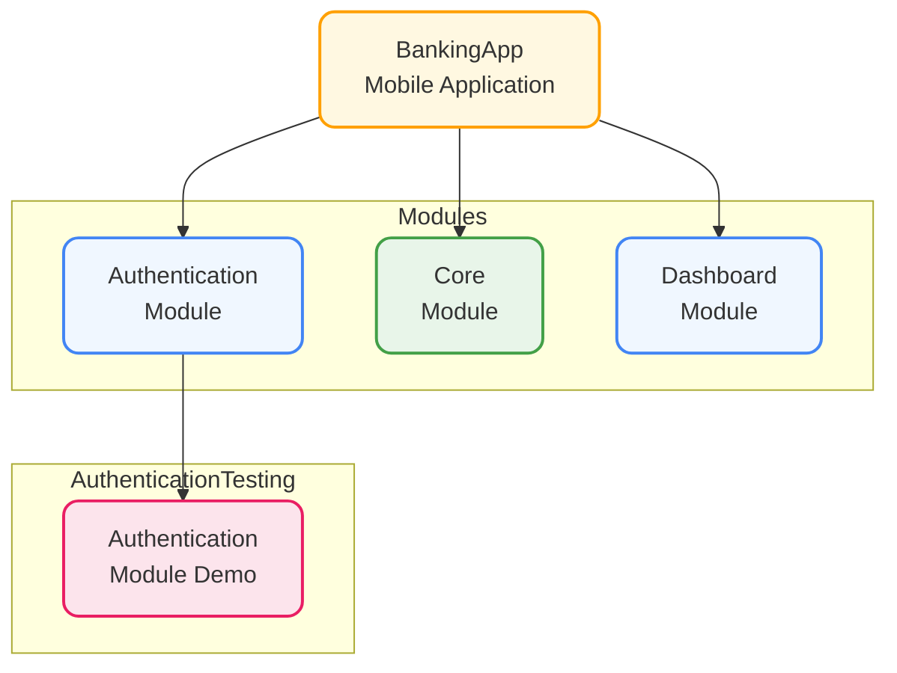

# Modular Banking App

## Architecture Overview

## Why Modular Architecture?

Modular architecture is crucial for large-scale applications due to:

- **Independent Development**: Multiple teams can work on different modules simultaneously without conflicts
- **Isolated Testing**: Each module can be tested independently, as demonstrated by the AuthenticationModule's demo app
- **Faster Development Cycles**: Changes in one module don't require rebuilding the entire application
- **Easy Integration**: Well-defined interfaces between modules enable smooth integration once testing is complete

## Implementation Details

- **UI Framework**: Built with SwiftUI for modern, declarative UI development
- **Architecture Pattern**: Follows MVVM-C (Model-View-ViewModel-Coordinator) for clean separation of concerns
- **Dependency Management**: Uses dependency injection for loose coupling between components

## Module Structure

- **AuthenticationModule**: Handles user authentication with a dedicated demo app for testing
- **CoreModule**: Contains shared functionality and base components
- **DashboardModule**: Manages main user interface and banking features

## Getting Started

1. Clone the repository
2. Open the workspace in Xcode
3. Build and run either the main app or individual module demos
4. For testing modules independently, use the respective demo targets

## Requirements
- Xcode 15.0+
- iOS 16.0+
- Swift 5.9+
