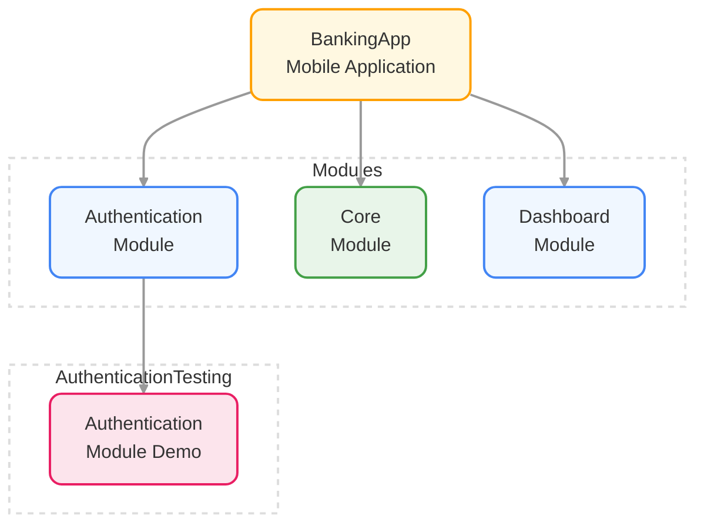

# BankingApp
This is a demonstration native iOS App to showcase possible implementation of Modular architecture in a Banking App

```mermaid
graph TD
    %% Define classes with lighter colors and rounded edges
    classDef moduleClass fill:#f0f7ff,stroke:#4285f4,stroke-width:2px,rx:10
    classDef appClass fill:#fff8e1,stroke:#ffa000,stroke-width:2px,rx:10
    classDef demoClass fill:#fce4ec,stroke:#e91e63,stroke-width:2px,rx:10
    classDef coreClass fill:#e8f5e9,stroke:#43a047,stroke-width:2px,rx:10

    BankingApp[BankingApp<br/>Mobile Application]:::appClass
    
    subgraph Modules
        AuthModule[Authentication<br/>Module]:::moduleClass
        CoreMod[Core<br/>Module]:::coreClass
        DashModule[Dashboard<br/>Module]:::moduleClass
    end
    
    subgraph AuthenticationTesting
        AuthDemo[Authentication<br/>Module Demo]:::demoClass
    end

    BankingApp --> AuthModule
    BankingApp --> CoreMod
    BankingApp --> DashModule
    
    AuthModule --> AuthDemo
    
    %% Styling for connections
    linkStyle default stroke:#999,stroke-width:2px;
    
    %% Add labels with lighter borders
    style Modules fill:none,stroke:#ddd,stroke-width:2px,stroke-dasharray: 5 5
    style AuthenticationTesting fill:none,stroke:#ddd,stroke-width:2px,stroke-dasharray: 5 5
```
